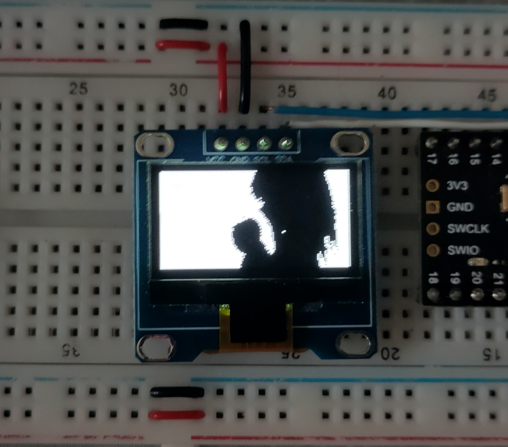

# Oled display video player

A simple video converter and player for 0.96" Oled diplay 

A python script convert the MP4 to a C header to include the video.
main.cpp contain the video player

The player was tested with Bad Apple as it is a common benchmark for binary display : https://youtu.be/LcOXxSb2GnA